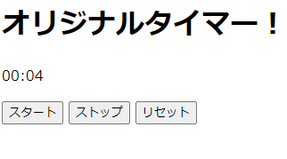
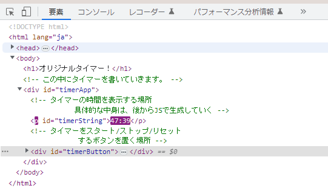
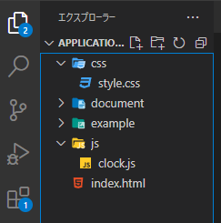
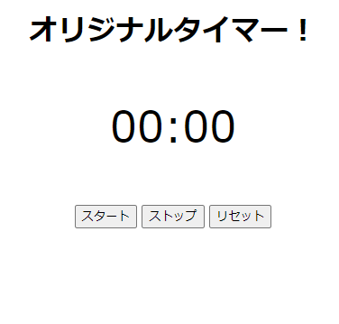

# JavaScript応用編1 - タイマーを作ってみる

- [JavaScript応用編1 - タイマーを作ってみる](#javascript応用編1---タイマーを作ってみる)
  - [0. 前提知識](#0-前提知識)
  - [1. HTMLを作成する](#1-htmlを作成する)
  - [2. JavaScriptでタイマーを動かしてみる](#2-javascriptでタイマーを動かしてみる)
    - [2-1. タイマーの時刻をHTML上に表示する](#2-1-タイマーの時刻をhtml上に表示する)
    - [2-2. タイマーをスタートし、時間を更新していく](#2-2-タイマーをスタートし時間を更新していく)
  - [App1. 上手く動かないときは](#app1-上手く動かないときは)
  - [3. タイマーのStop機能を作ってみる](#3-タイマーのstop機能を作ってみる)
    - [3-1. タイマーをストップする](#3-1-タイマーをストップする)
    - [3-2. タイマーをリスタートする](#3-2-タイマーをリスタートする)
  - [4. タイマーのReset機能を作ってみる](#4-タイマーのreset機能を作ってみる)
  - [5. 仕上げのCSS](#5-仕上げのcss)
  - [6. 完成！](#6-完成)


## 0. 前提知識
JavaScriptを始めとするWeb開発の入門について勉強するためのコンテンツです。基礎的な**HTML/CSS, JavaScriptの書き方**、**JSのオブジェクト**、**JSの関数周り**について、ある程度把握している前提で話をしています。

次のワードが何かピンと来ていない人は、まず以下のようなコンテンツを見てみてください。特に無名関数やDOMなんかは、本コンテンツの中でも使用します。**paizaラーニングの教材**で説明があるHTML/CSS/JSの基礎については、必ず必要になるのであらかじめ取り組んでみて、ある程度理解しておいて欲しいです。**JavaDriveの内容**は、難しいところも多いのでふーんそういうこともあるのね、程度の理解でも大丈夫です。使いながら慣れていきましょう。

- HTML/CSS：[paizaラーニングの教材](https://paiza.jp/works/html/primer)
- JavaScriptのfor文, if文, 変数：[paizaラーニングの教材](https://paiza.jp/works/js/primer)
- JavaScriptの関数：[JavaDriveの説明](https://www.javadrive.jp/javascript/function/index2.html)
- 関数とオブジェクト：[JavaDriveの説明](https://www.javadrive.jp/javascript/function/index10.html)
- **無名関数**：[JavaDriveの説明](https://www.javadrive.jp/javascript/function/index5.html)
- **DOM**：[JavaDriveの説明](https://www.javadrive.jp/javascript/dom/index1.html)

---
## 1. HTMLを作成する
HTMLファイルで記述する内容は、今回作成するストップウォッチを載せる土台になります。まずは図のように「index.html」を作成しましょう。


HTMLファイルの中には、head要素、body要素などの典型的なものの他に、タイマーの文字やボタンを配置する領域を書いておきます。ここに後からJavaScriptで文字を表示させたり、ボタンを追加したりしていきます。
```html:index.html
<!DOCTYPE html>
<html lang="ja">
  <head>
    <meta charset="UTF-8">
    <title>Myタイマー</title>
  </head>

  <body>
    <h1>オリジナルタイマー！</h1>

    <!-- この中にタイマーを書いていきます。 -->
    <div id="timerApp">
      <!-- タイマーの時間を表示する場所
           具体的な中身は、後からJSで生成していく -->
      <p id="timerString"></p>

      <!-- タイマーをスタート/ストップ/リセット
            するボタンを置く場所 -->
      <div id="timerButton">
      </div>
    </div>

  </body>
</html>
```

**タイマーのStart/Stop/Resetをするボタン**はHTMLの要素で書いておきます。クリックしたときにJSの関数を呼び出せるものなら何でも良いのですが、今回は**inputのbutton**を使用しました。input要素の中の```onClick="~~~"```という所に、**ボタンを押したときに呼び出す関数**を書いておきます。関数名は後々書いていくJavaScriptファイル内の関数名に対応させてください。

また、```value="~~~"```の部分を変更すると、ページを表示した際にボタンの中に表示される文字列が変わります。試してみてください。
```html:
<!-- タイマーをスタート/ストップ/リセット
      するボタンを置く場所 -->
<div id="timerButton">
  <!-- onClick=" ~~~ "と言うところで、
        ボタンを押したときに呼ばれる関数を指定する -->
  <input type="button" value="スタート" onClick="OnStartButtonClick();">
  <input type="button" value="ストップ" onClick="OnStopButtonClick();">
  <input type="button" value="リセット" onClick="OnResetButtonClick();">
</div>
```
ここまで記述すると、index.htmlをブラウザで開いてもらうと画像のように表示されているかと思います。ただし、今はJavaScriptの処理を書いていないので、ボタンを押しても何も動きません…。


---
## 2. JavaScriptでタイマーを動かしてみる
次は、実際にタイマーを動かしてみるところまで進めてみましょう。まず、JavaScriptのファイルをHTML内で読み込むために、script要素を記述しておきます。今回はhead要素の中で書きました。

```html
<head>
  <meta charset="UTF-8">
  <title>Myタイマー</title>
  <script src="./js/clock.js"></script>
</head>
```

JavaScriptのプログラムを記述するファイルは、**script要素のsrcに対応させて**画像のように作成しておきます。


このJavaScriptファイル内でやりたいことは下記のようなことです。順番に実装していきましょう。なお、ここからのコードはclock.jsに記述していってください。

1. タイマーの時刻をHTML上に表示する
2. タイマーをスタートする
3. タイマーの時刻を毎秒更新する

### 2-1. タイマーの時刻をHTML上に表示する
ここで行うことは、前提知識の項にあった**DOM**というものの操作です。DOMは、簡単に言えばHTMLのタグで囲われた1要素を、JavaScriptなどの**プログラムでいじれるようにしたもの**です。タグで囲まれた要素というのは、例えば下記画像のように、青い箇所はtimerButtonというIDをもったdiv要素の区域です。黄色い箇所には別々の3つのinput要素が並んでいます。と言うようになっていて、HTMLはこの要素が階層構造を成してホームページを形成しています。こうした要素をプログラムからいじれるようにしたのがDOMです。


プログラムでいじれると言うと抽象的ですが、具体的にはそのタグの中身を編集することができたり、その要素のclassの値やidの値を変更することができたり、その区画に新しい要素を追加したり削除したりすることもできます。

では今回の実装です。下記のようなコードをclock.jsの中に書きましょう。

```js
// タイマーの時間を表示する場所を覚えておく変数
let timerStringDOM;

// ここに記述したイベントは、htmlが完全に読み込まれた後から実行される。
window.onload = function() {
  timerStringDOM = document.getElementById('timerString');

  // 開始する前は00:00と表示
  timerStringDOM.innerHTML = '00:00'
};
```

今回は、上の図で赤枠で囲った```timerString```というidの付いたp要素をいじっていきます。p要素の中に時刻を表す文字列を表示し、それを時間経過で更新していきたいです。ということで、まずはその**p要素を見つけるところから**始めます。

要素の見つけ方は色々あるのですが、1つにHTML内に記載している要素のidで探す方法があります。コードの```document.getElementById関数```で、引数に見つけたい要素のIDを渡すことでその要素を探してくれます。今回だったら```timerString```というidの要素を探したいので、```document.getElementById('timerString')```のように記述できますね。

要素を探す関数は、**既に読み込みが完了しているHTML内から要素を探します**。HTMLを読み込むとは、ブラウザでページを開いて、ぐるぐるとロードをしている状態です。このロードが終わってから要素を探さないと、上記の関数でも要素を見つけることができません。

このように読み込みが終わった後に実行したい処理は、上記のコードの```window.onload = [何かしらの関数]```という形式で記述することができます。ここでは前提知識でも紹介した無名関数を使って、ページが読み込まれた後にしたい処理を関数として記述して代入しています。

p要素を見つけることができたら、**それを変数timerStringDOMに入れておきます**。DOMはHTMLをプログラムでいじれるようにしたもの。このように変数に入れて、それを参照したり変更したりすることができます。この変数に入れた要素は、この関数内でも変更しますし、後々、表示内容を更新する際にも変更します。このように別の処理からもこの変数を使用したいときは、一旦関数の外で変数を宣言しておき、その変数に代入していきましょう。

今回はこのp要素に経過時間を表示したいです。こういうときは、p要素の中、すなわちpタグで囲われた間に文字を追加していくことになります。これは、要素を格納した変数に対して、```[変数名].innerHTML```に値を代入することで変更できます。今回は初期値として、pタグの中に00:00という文字列を記述しておきました。

ここまで書いて、一度ブラウザを更新してもらうと、図のように初期値00:00という文字列が表示されているでしょう。


### 2-2. タイマーをスタートし、時間を更新していく
ここで書くコードは次の通りです。詳しく説明していきます。

```js
/// 省略 ////

// 開始時間を記録しておく変数
let startTime;

// ここに記述したイベントは、htmlが完全に読み込まれた後から実行される。
window.onload = function() {
  /// 省略 ////
};

// ミリ秒を経過時間の文字列に直す関数
function msecToSecString(time) {
  // 単位をミリ秒から秒へ変換
  time = Math.floor(time / 1000);

  // 秒数
  const seconds = time % 60;
  // 分数
  const minutes = Math.floor(time / 60);

  // 取得した数値をも2桁の文字列になるように、必要に応じて0を補う
  const secondStr = (seconds < 10 ? '0' : '') + String(seconds);
  const minutesStr = (minutes < 10 ? '0' : '') + String(minutes);

  return minutesStr + ":" + secondStr;
}

// タイマーの時刻を更新する処理
function UpdateTimer() {
  // 現在の時刻を取得
  const nowTime = new Date().getTime();

  // タイマーの表示を更新
  timerStringDOM.innerHTML = msecToSecString(nowTime - startTime);
}

// スタートボタンが押されたときの処理
function OnStartButtonClick() {
  // 変数startTimeに開始時間を所持しておく
  // 現在の時間は、基準時からの経過時間(単位：ミリ秒)
  startTime = new Date().getTime();

  setInterval(UpdateTimer, 1000);
}
```

ではまず、スタートボタンを押してタイマーをスタートさせる処理を書いていきます。スタートボタンを押したときには、```OnStartButtonClick関数```が呼ばれるように、HTML内のbuttonに記述していましたね。ですので、このOnStartButtonClick関数の中で処理を書きます。

まずはタイマーのスタート時刻を取得しておきます。これはDateオブジェクトのgetTime()メソッドから取得できます。Dateオブジェクトの詳細について話すと本当に長くなってしまうので、詳細は各自で調べてみてください。このメソッド(関数)を呼ぶことで、**ある基準時(1970年とか)からの経過時間(単位：ミリ秒)を**取得できます。この**経過時間との差**を利用して、スタート時刻から何秒経ったかを計算していきます。取得したスタート時刻は変数startTimeに代入しておきましょう。この変数は、タイマーを更新する処理でも使うので、関数の外であらかじめ宣言しています。

スタート時間を記録したら、次に毎秒タイマーを更新させる関数を設定しておきます。今回は```UpdateTimer```と言う関数でタイマーを更新させます。```setInterval関数```の引数で指定することで、**定期的に呼び出す関数とその呼び出し間隔(単位：ミリ秒)を指定する**ことができます。今回だったら、1秒(1000ミリ秒)おきにタイマーを更新する関数(UpdateTimer関数)を呼びたいので、```setInterval(UpdateTimer, 1000);```と書くことができます。

タイマー更新のUpdateTimer関数では、**startTimeと現在時刻の差を見て経過時間を計算**し、それを表示します。変数nowTimeに現在時刻を取得して、それとstartTimeとの差をmsecToSecString関数という自作の関数に渡して文字列に変換し、先ほどもつかったp要素のinnerHTMLに代入して表示内容を更新しています。

**msecToSecString関数**では、getTime関数で取得できる値がミリ秒の単位なので、それをまずは秒の単位に直し、その秒から分も求めています。後半、secondStrとminutesStrを宣言している箇所では、**三項演算子**と言うもので条件分岐をしています。秒数/分が10未満だと1桁になってしまうので、そのときは02秒のように0を付与し、10未満じゃないなら何も付与しない、という処理を書いています。```String(seconds)```は**数値型からString型へのキャスト(型変換)です**。三項演算子とかキャストとかが分からなければ、都度調べて見てください。最後に、この秒数と分の文字列をくっ付けて戻り値で返しています。

ここまで書けたら、ブラウザを更新して、スタートボタンを押してみてください。そうすると画像のように表示時間がどんどんとカウントアップされていくようになったでしょうか。ただ、まだこのタイマー止めたりリセットしたりできません。次からはこのストップとリセットの処理を書いていきます。



---
## App1. 上手く動かないときは
プログラムが上手く動かないときは、エラーログを見てみたり、途中の変数の値を見てみるのがプログラミングの定石ですね。JSのプログラミングではブラウザの開発者ツールを使用してデバッグをすることが多いです。開発者ツールはブラウザ上でF12キーを押すか、右クリック=>検証とクリックして開くことができます。開くと、下図のように「要素」や「コンソール」の選択ができ、このうちのコンソールにJSのエラーログなどが表示されます。



他にも、プログラム中である変数の値がどうなっているか見たい時などは、```console.log([出力したい文字列や変数]);```と記述することで、任意の内容をコンソールに出力することができます。これをデバッグの用途で使うことが多々あります。

---
## 3. タイマーのStop機能を作ってみる
ここら辺からは、言語の仕様というよりも、どのようにプログラムを組むかのアルゴリズムの色が強くなってきて、コードを見て流れを理解して貰う方が手っ取り早いこともあるかもしれません。個人的には文字の説明よりコード追った方が理解しやすいのです。その辺は皆さんにあった方法でチャレンジしてみてください。

タイマーのストップ機能でしたいことは次のようなことです。

- タイマーの時間カウントを止める
- もう一度スタートを押すと、途中からタイマーのカウントアップを再開する

それでは次のような事を書いていきましょう。省略しているところは、特段の追記が無い箇所です。

```js
// タイマーの時間を表示する場所を覚えておく変数
let timerStringDOM;

// 開始時間を記録しておく変数
let startTime;

// タイマーを識別するID
let timerId = null;

// 現在の経過時間を記録しておく変数
let currentTimerTime = 0;

// ここに記述したイベントは、htmlが完全に読み込まれた後から実行される。
window.onload = function() {
  /// 省略 ///
};

// ミリ秒を経過時間の文字列に直す関数
function msecToSecString(time) {
  /// 省略 ///
}

// タイマーの時刻を更新する処理
function UpdateTimer() {
  /// 省略 ///
}

// スタートボタンが押されたときの処理
function OnStartButtonClick() {
  // すでにタイマーが動いていないことを確認する
  if(timerId == null) {
    // 変数startTimeに開始時間を所持しておく
    // 現在の時間は、基準時からの経過時間(単位：ミリ秒)
    startTime = new Date().getTime() - currentTimerTime;

    // 1秒(=1000ミリ秒)ごとにタイマーを更新する処理を記述する
    timerId = setInterval(UpdateTimer, 1000);
  }
}

// ストップボタンが押されたときの処理
function OnStopButtonClick() {
  // すでにタイマーが動いていることを確認する
  if(timerId != null) {
    // タイマーIDで指定したタイマーをストップする
    clearInterval(timerId);
    timerId = null;

    // 現在までの経過時間を記録してタイマーの表示を更新
    const nowTime = new Date().getTime();
    currentTimerTime = nowTime - startTime;

    timerStringDOM.innerHTML = msecToSecString(currentTimerTime);
  }
}
```

### 3-1. タイマーをストップする
まずは、動いているタイマーを止める処理を書いていきます。HTMLに記述した内容から、ストップボタンを押すと```OnStopButtonClick関数```が呼ばれましたので、その関数の中に処理を書いていきましょう。

その前に、そもそもタイマーは、```setInterval関数```で**定期的に関数を呼び出す設定をする**ことで、毎秒更新されていましたね。ですのでタイマーを止めるときは、この**定期的に関数を呼び出す設定を解除する**必要がでてきます。

実装上では、変数timerIdにその定期実行の設定をしたID（設定を識別するもの）を保持しています。このIDは```setInterval関数```の戻り値として取得することができ、```OnStartButtonClick関数```の中で定期実行を設定する際に取得しています。定期実行を解除するときは、```clearInterval関数```に解除したい定期実行のIDを引数として渡してやることで、その定期実行の設定が解除されます。

また、何度もスタートボタンをクリックしたときに、いくつも定期実行を設定してしまわないように、変数timerIdがnull（からっぽでまだ何も代入されていない状態）のときだけsetInterval関数で定期実行を設定するように、```OnStartButtonClick関数```の中で条件分岐を追記しています。

同様に、タイマーが動いてもいない時にタイマーをストップしようとすることが無いように、```OnStopButtonClick関数```で、timerIdがnullでない時だけタイマーを止めるように書き、またタイマーを止めたら改めてtimerIdをnullに設定しています。

### 3-2. タイマーをリスタートする
タイマーを後々リスタートするには、**タイマーをストップした時点までの経過時間を覚えておく**必要がありますね。リスタート時には、その途中の時間から、再度カウントを開始したいからです。そこで、変数currentTimerTimeに、ストップ時の経過時間を記録しておきます。ついでに、そのストップ時の時間でタイマーの表示時刻も更新しておきます。

リスタート時には、その途中経過の時間currentTimerTimeの分だけスタート時間に下駄を履かせてやれば、途中経過までの時間分遅くしたスタート時間が設定できますね。これを```OnStartButtonClick関数```の中の```startTime = new Date().getTime() - currentTimerTime;```で記載しています。

ここまで書くと、タイマーのストップボタンを押すことで、タイマーを一時停止させたり、タイマーをリスタートさせたりができるようになっているかと思います。最後に、タイマーの表示時刻をリセットする処理を作っていきましょう。

---
## 4. タイマーのReset機能を作ってみる
最後、タイマーのリセットは単純です。要は、タイマーをスタートする以前の状態に戻せばオッケーです。リセット時にしたいことは、まずタイマーをストップしてあげて、表示時間を00:00に戻してあげて、現在までの経過時間を0にするといったことですね。タイマーのストップは前項で作った```OnStopButtonClick関数```を呼び出してあげることでできます。後は諸々の変数を初期値に戻してあげればおっけーです。

実装のコードは単純に、以下のようになります。

```js
/// 省略 ///

// ストップボタンが押されたときの処理
function OnStopButtonClick() {
  /// 省略 ///
}

// リセットボタンが押されたときの処理
function OnResetButtonClick() {
  // 一度タイマーを止める
  OnStopButtonClick();

  // 表示時間を00:00にする
  timerStringDOM.innerHTML = '00:00';

  // 経過時間をリセット
  currentTimerTime = 0;
}
```

---
## 5. 仕上げのCSS
最後は見た目を良い感じにしていくために、CSSでちょっと飾り付けをしていきます。CSSの装飾は、ホントにいくらでもいじれる底なし沼です。ある程度で終わりにしないと、時間が溶けますのでご注意ください。CSSを追加するためにディレクトリでCSSファイルを作成し、index.htmlにはheadの中に以下のように書いておきます。

```html
<head>
  <meta charset="UTF-8">
  <title>Myタイマー</title>
  <script src="./js/clock.js"></script>
  <link rel="stylesheet" href="./css/style.css">
</head>
```



ここら辺はホントに個人の感覚なのですが、まずは右揃えが不格好なので、全体を中央揃えにしておきましょう。style.cssに以下のように記述してください。

```css
body {
  text-align: center;
}
```

あとは、タイマーの文字表記がもう少し大きい方が見やすいので、文字サイズも大きくしておきましょうか。

```css
#timerString {
  font-size: 3em;
}
```

ここまでやるとこんな感じで、ブラウザ表示されるようになったかと思います。良い感じですね！(主観)



---
## 6. 完成！
ひとまずこれで完成です。各ファイルの最終的な内容は以下に記載しておくので、上手く動いていないときは、どこが間違っているのか確認してみてください。

<details><summary>index.html</summary>

```html
<!DOCTYPE html>
<html lang="ja">
  <head>
    <meta charset="UTF-8">
    <title>Myタイマー</title>
    <script src="./js/clock.js"></script>
    <link rel="stylesheet" href="./css/style.css">
  </head>

  <body>
    <h1>オリジナルタイマー！</h1>

    <!-- この中にタイマーを書いていきます。 -->
    <div id="timerApp">
      <!-- タイマーの時間を表示する場所
           具体的な中身は、後からJSで生成していく -->
      <p id="timerString"></p>

      <!-- タイマーをスタート/ストップ/リセット
            するボタンを置く場所 -->
      <div id="timerButton">
        <!-- onClick=" ~~~ "と言うところで、
              ボタンを押したときに呼ばれる関数を指定する -->
        <input type="button" value="スタート" onClick="OnStartButtonClick();">
        <input type="button" value="ストップ" onClick="OnStopButtonClick();">
        <input type="button" value="リセット" onClick="OnResetButtonClick();">
      </div>
    </div>

  </body>
</html>
```

</details>

<details><summary>js/clock.js</summary>

```js
// タイマーの時間を表示する場所を覚えておく変数
let timerStringDOM;

// 開始時間を記録しておく変数
let startTime;

// タイマーを識別するID
let timerId = null;

// 現在の経過時間を記録しておく変数
let currentTimerTime = 0;

// ここに記述したイベントは、htmlが完全に読み込まれた後から実行される。
window.onload = function() {
  timerStringDOM = document.getElementById('timerString');

  // 開始する前は00:00と表示
  timerStringDOM.innerHTML = '00:00'
};

// ミリ秒を経過時間の文字列に直す関数
function msecToSecString(time) {
  // 単位をミリ秒から秒へ変換
  time = Math.floor(time / 1000);

  // 秒数
  const seconds = time % 60;
  // 分数
  const minutes = Math.floor(time / 60);

  // 取得した数値をも2桁の文字列になるように、必要に応じて0を補う
  const secondStr = (seconds < 10 ? '0' : '') + String(seconds);
  const minutesStr = (minutes < 10 ? '0' : '') + String(minutes);

  return minutesStr + ":" + secondStr;
}

// タイマーの時刻を更新する処理
function UpdateTimer() {
  // 現在の時刻を取得
  const nowTime = new Date().getTime();

  // タイマーの表示を更新
  timerStringDOM.innerHTML = msecToSecString(nowTime - startTime);
}

// スタートボタンが押されたときの処理
function OnStartButtonClick() {
  // すでにタイマーが動いていないことを確認する
  if(timerId == null) {
    // 変数startTimeに開始時間を所持しておく
    // 現在の時間は、基準時からの経過時間(単位：ミリ秒)
    startTime = new Date().getTime() - currentTimerTime;

    // 1秒(=1000ミリ秒)ごとにタイマーを更新する処理を記述する
    timerId = setInterval(UpdateTimer, 1000);
  }
}

// ストップボタンが押されたときの処理
function OnStopButtonClick() {
  // すでにタイマーが動いていることを確認する
  if(timerId != null) {
    // タイマーIDで指定したタイマーをストップする
    clearInterval(timerId);
    timerId = null;

    // 現在までの経過時間を記録してタイマーの表示を更新
    const nowTime = new Date().getTime();
    currentTimerTime = nowTime - startTime;

    timerStringDOM.innerHTML = msecToSecString(currentTimerTime);
  }
}

// リセットボタンが押されたときの処理
function OnResetButtonClick() {
  // 一度タイマーを止める
  OnStopButtonClick();

  // 表示時間を00:00にする
  timerStringDOM.innerHTML = '00:00';

  // 経過時間をリセット
  currentTimerTime = 0;
}
```

</details>

<details><summary>css/style.css</summary>

```css
body {
  text-align: center;
}

#timerString {
  font-size: 3em;
}
```

</details>

この記事ではWeb開発入門の足掛かりとして、DOM操作を用いたタイマーを開発してみました。実際の制作の中ではライブラリを使うのでDOMをいじることは少ないのですが、Webの入門として、また1つの武器として使っていけるかなと思います。