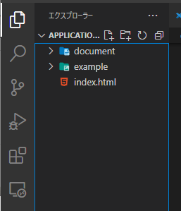
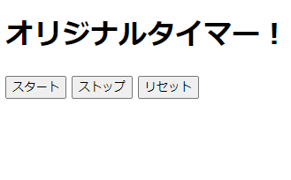
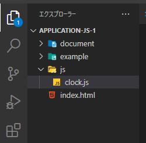
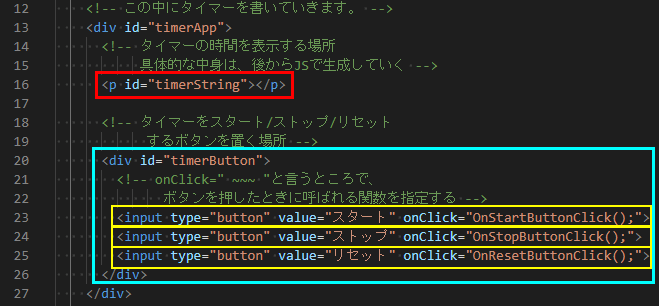
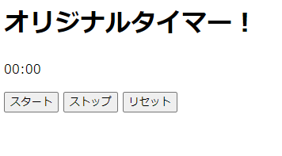

## JavaScript応用編1 - タイマーを作ってみる

- [JavaScript応用編1 - タイマーを作ってみる](#javascript応用編1---タイマーを作ってみる)
  - [0. 前提知識](#0-前提知識)
  - [1. HTMLを作成する](#1-htmlを作成する)
  - [2. JavaScriptでタイマーを動かしてみる](#2-javascriptでタイマーを動かしてみる)
    - [2-1. タイマーの時刻をHTML上に表示する](#2-1-タイマーの時刻をhtml上に表示する)
    - [2-1. タイマーをスタートし、時間を更新していく](#2-1-タイマーをスタートし時間を更新していく)
  - [上手く動かないときは](#上手く動かないときは)


### 0. 前提知識
JavaScriptを始めとするWeb開発の入門について勉強するためのコンテンツです。基礎的な**HTML/CSS, JavaScriptの書き方**、**JSのオブジェクト**、**JSの関数周り**について、ある程度把握している前提で話をしています。

次のようなワードが何かピンと来ていない人は、次のようなコンテンツにまずは取り組んでください。特に無名関数やDOMなんかは、本コンテンツの中でも使用します。**paizaラーニングの教材**で説明があるHTML/CSS/JSの基礎については、必ず必要になるのであらかじめ取り組んでみて、ある程度理解しておいて欲しいです。**JavaDriveの内容**は、難しいところも多いのでふーんそういうこともあるのね、程度の理解でも大丈夫です。使いながら慣れていきましょう。
- HTML/CSS：[paizaラーニングの教材](https://paiza.jp/works/html/primer)
- JavaScriptのfor文, if文, 変数：[paizaラーニングの教材](https://paiza.jp/works/js/primer)
- JavaScriptの関数：[JavaDriveの説明](https://www.javadrive.jp/javascript/function/index2.html)
- 関数とオブジェクト：[JavaDriveの説明](https://www.javadrive.jp/javascript/function/index10.html)
- **無名関数**：[JavaDriveの説明](https://www.javadrive.jp/javascript/function/index5.html)
- **DOM**：[JavaDriveの説明](https://www.javadrive.jp/javascript/dom/index1.html)

### 1. HTMLを作成する
HTMLファイルで記述する内容は、今回作成するストップウォッチを載せる土台になります。

まずは図のように「index.html」を作成しましょう。



HTMLファイルの中には、head要素、body要素などの典型的なものの他に、タイマーの文字やボタンを配置する領域を書いておきます。ここに後からJavaScriptで文字を表示させるのと、ボタンを追加していきます。
```index.html
<!DOCTYPE html>
<html lang="ja">
  <head>
    <meta charset="UTF-8">
    <title>Myタイマー</title>
  </head>

  <body>
    <h1>オリジナルタイマー！</h1>

    <!-- この中にタイマーを書いていきます。 -->
    <div id="timerApp">
      <!-- タイマーの時間を表示する場所
           具体的な中身は、後からJSで生成していく -->
      <p id="timerString"></p>

      <!-- タイマーをスタート/ストップ/リセット
            するボタンを置く場所 -->
      <div id="timerButton">
      </div>
    </div>

  </body>
</html>
```

次にHTMLファイル内でできることを済ませます。**タイマーをStart/Stop/Resetさせるボタン**はHTMLの要素で書いておきます。ボタンでなくても、クリックしたときにJSの関数を呼び出せるものなら何でも良いですが、今回は**inputのbutton**を使用しました。input要素の中の```onClick="~~~"```という所に、**ボタンを押したときに呼び出す関数の名前と括弧**を書いておきます。関数名は後々書いていくJavaScriptファイル内の関数名に対応させてください。

また、```value="~~~"```の部分を変更すると、ページを表示した際にボタンの中に表示される文字列が変わります。試してみてください。
```
<!-- タイマーをスタート/ストップ/リセット
      するボタンを置く場所 -->
<div id="timerButton">
  <!-- onClick=" ~~~ "と言うところで、
        ボタンを押したときに呼ばれる関数を指定する -->
  <input type="button" value="スタート" onClick="OnStartButtonClick();">
  <input type="button" value="ストップ" onClick="OnStopButtonClick();">
  <input type="button" value="リセット" onClick="OnResetButtonClick();">
</div>
```
ここまで記述すると、index.htmlをブラウザで開いてもらうと画像のように表示されているかと思います。ただし、今はJavaScriptの処理を書いていないので、ボタンを押しても何も動きません…。



### 2. JavaScriptでタイマーを動かしてみる
次は、実際にタイマーを動かしてみるところまで進めてみましょう。まず、JavaScriptのファイルをHTML内で読み込むために、script要素を記述しておきます。今回はhead要素の中で書きました。

```
<head>
  <meta charset="UTF-8">
  <title>Myタイマー</title>
  <script src="./js/clock.js"></script>
</head>
```

JavaScriptのプログラムを記述するファイルは、**script要素のsrcに対応させて**画像のように作成しておきます。


このJavaScriptファイル内でやりたいことは下記のようなことです。順番に実装していきましょう。なお、ここからのコードはclock.jsに記述していってください。

1. タイマーの時刻をHTML上に表示する
2. タイマーをスタートする
3. タイマーの時刻を毎秒更新する

#### 2-1. タイマーの時刻をHTML上に表示する
ここで行うことは、前提知識の項にあった**DOM**というものの操作です。DOMは、簡単に言えばHTMLのタグで囲われた1区間を、JavaScriptなどのプログラムでいじれるようにしたものです。例えば下記画像のように、青い区画はtimerButtonというIDをもったdiv要素の区域です。黄色い区間にはそれぞれ別々の3つのinput要素の区間からなっています。



プログラムでいじれると言うと抽象的ですが、具体的にはその区画の中身(タグの中身)を編集することができたり、その要素のclassの値やidの値を変更することができたり、その区画に新しい要素を追加したり(divの中にinputをもう1つ足すとか)削除したりすることもできます。

では、今回の実装です。今回の実装では下記のようなコードをclock.jsの中に書きましょう。

```
// タイマーの時間を表示する場所を覚えておく変数
let timerStringDOM;

// ここに記述したイベントは、htmlが完全に読み込まれた後から実行される。
window.onload = function() {
  timerStringDOM = document.getElementById('timerString');

  // 開始する前は00:00と表示
  timerStringDOM.innerHTML = '00:00'
};
```

今回は、上の図で赤枠で囲った```timerString```というIDの付いたp要素をいじっていきます。p要素の中に時刻を表す文字列を表示し、それを時間経過で更新していきたいです。ということで、まずはその**p要素を見つけます**。

要素の見つけ方は色々あるのですが、例えばHTML内に記載している要素のidで探すことができます。コードの```document.getElementById関数```で、引数に見つけたい要素のIDを渡すことでその要素を探してくれます。今回だったら```timerString```というidの要素を探したいので、```document.getElementById('timerString')```のように記述できますね。

要素を探す関数は、**既に読み込みが完了しているHTML内から要素を探します**。HTMLが読み込まれるとは、ブラウザでページを開いて、ぐるぐるとロードしている時に行われていることです。このロードが終わってから要素を探さないと、上記の関数でも要素を見つけることができません。

このように読み込みが終わった後に実行したい処理は、上記のコードの```window.onload = [何かしらの関数]```という形式で記述することができます。ここでは前提知識でも紹介した無名関数を使って、ページが読み込まれた後にしたい処理を関数として記述して代入しています。

p要素を見つけることができたら、**それを変数timerStringDOMに入れておきます**。DOMはHTMLをプログラムでいじれるようにしたもの。このように変数に入れて、それを参照したり変更したりすることができます。この変数に入れた要素は、この関数内でも変更しますし、後々、表示内容を更新する際にも変更します。このように別の処理からもこの変数を使用したいときは、一旦関数の外で変数を宣言しておき、関数内でその変数に代入していきましょう。

今回は**このp要素に経過時間を表示したい**です。こういうときは、このp要素の中、すなわちpタグで囲われた間に文字を追加していくことになります。これは、要素を格納した変数で、```[変数名].innerHtml```に値を代入してあげることで変更できます。今回は初期値として、pタグの中に00:00という文字列を記述しておきました。

ここまで書くと、一度ブラウザを更新してもらうと、図のように初期値00:00という文字列が表示されているでしょう。



#### 2-1. タイマーをスタートし、時間を更新していく
ここで書くコードは次の通りです。詳しく説明していきます。

```
/// 省略 ////


// 開始時間を記録しておく変数
let startTime;

// ここに記述したイベントは、htmlが完全に読み込まれた後から実行される。
window.onload = function() {
  /// 省略 ////
};

// ミリ秒を経過時間の文字列に直す関数
function msecToSecString(time) {
  // 単位をミリ秒から秒へ変換
  time = Math.floor(time / 1000);

  // 秒数
  const seconds = time % 60;
  // 分数
  const minutes = Math.floor(time / 60);

  // 取得した数値をも2桁の文字列になるように、必要に応じて0を補う
  const secondStr = (seconds < 10 ? '0' : '') + String(seconds);
  const minutesStr = (minutes < 10 ? '0' : '') + String(minutes);

  return minutesStr + ":" + secondStr;
}

// タイマーの時刻を更新する処理
function UpdateTimer() {
  // 現在の時刻を取得
  const nowTime = new Date().getTime();

  // タイマーの表示を更新
  timerStringDOM.innerHTML = msecToSecString(nowTime - startTime);
}

// スタートボタンが押されたときの処理
function OnStartButtonClick() {
  // 変数startTimeに開始時間を所持しておく
  // 現在の時間は、基準時からの経過時間(単位：ミリ秒)
  startTime = new Date().getTime();

  setInterval(UpdateTimer, 1000);
}
```

ではまず、スタートボタンを押してタイマーをスタートさせる処理を書いていきます。スタートボタンを押したときには、```OnStartButtonClick関数```が呼ばれるように、HTML内のbuttonに記述していました。ですので、この関数内で処理を書きます。

まずはタイマーのスタート時刻を取得しておきます。これはDateオブジェクトのgetTime()メソッドから取得できます。これの詳細について話すと本当に長くなってしまうので、詳細は各自で調べてみてください。このメソッド(関数)を呼ぶことで、**ある基準時(1970年とか)からの経過時間(単位：ミリ秒)**を取得できます。この**経過時間の差**を利用して、start時から何秒経ったかを計算していきます。取得した時間は変数startTimeに代入しておきましょう。この変数は、タイマーを更新する処理でも使うので、関数の外であらかじめ宣言しています。

スタート時間を記録したら、次に毎秒タイマーを更新させる関数を設定しておきます。今回は```UpdateTimer```と言う関数でタイマーを更新させます。```setInterval関数```で、引数で指定することで、定期的に呼び出す関数とその呼び出し間隔(単位：ミリ秒)を指定することができます。今回だったら、1秒(1000ミリ秒)おきにタイマーを更新する関数(UpdateTimer関数)を呼びたいので、```setInterval(UpdateTimer, 1000);```と書くことができます。

更新の関数では、**startTimeと現在時刻の差を見て経過時間を計算**し、それを表示します。変数nowTimeに現在時刻を取得して、それとstartTimeとの差をmsecToSecString関数という自作関数に渡して文字列に変換し、先ほどもつかったp要素のinnerHTMLで表示内容を更新しています。

**msecToSecString関数**では、getTime関数で取得できる値がミリ秒の単位なので、それをまずは秒の単位に直し、その秒から分も求めています。その後の2行では**三項演算子**と言うもので条件分岐をして、秒数/分が10未満だと1桁になってしまうので、そのときは02秒のように0を付与し、10未満じゃないなら何も付与しない、という処理を書いています。```String(seconds)```は**数値型からString型へのキャスト(型変換)**です。三項演算子とかキャストとかが分からなければ、都度調べて見てください。最後に、この秒数と分の文字列をくっ付けて戻り値で返しています。


### 上手く動かないときは
上手く動かないときは、エラーログを見てみたり、途中の変数の値を見てみるのがプログラミングの定石ですね。JSのプログラミングでは


F12キーもしくはブラウザ上で右クリックしてみると、開発者ツールを閲覧できる。その中のコンソールにエラーが出ている。